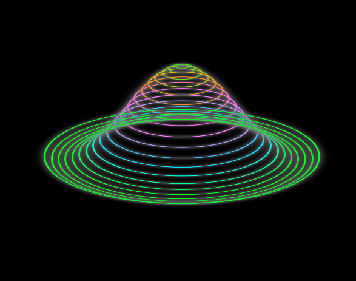

<<<<<<< HEAD
# Neon Circles Animation

This project is a pure HTML and CSS visual animation that creates pulsing neon circles with 3D effects and hue rotation. It's perfect for visual experiments, portfolio intros, or creative backgrounds.

## 📸 Preview

## 🚀 How to Use

1. Save this code as `index.html`
2. Open it in your browser (double-click or use Live Server)

## 🧱 Technologies Used

- HTML5  
- CSS3 (Flexbox, Animations, Custom Properties)

## 🎨 Customization

You can:
- Change the colors of the circles (`border`, `box-shadow`)
- Adjust the number of circles by duplicating `
`
- Modify the animation speed or height in the `@keyframes` section

## 📁 Project Structure

neon-circles-animation/
=======

# Neon Circles Animation

Este projeto é uma animação visual feita puramente com HTML e CSS, criando círculos neon pulsantes com efeitos 3D e rotação de matiz. Ideal para experiências visuais, introduções de portfólio ou backgrounds criativos.

## 📸 Prévia

## 🚀 Como Usar

1. Salve este código como `index.html`
2. Abra no navegador (duplo clique ou Live Server)

## 🧱 Tecnologias Utilizadas

- HTML5
- CSS3 (Flexbox, Animações, Custom Properties)

## 🎨 Personalização

Você pode:
- Alterar as cores dos círculos (`border`, `box-shadow`)
- Mudar a quantidade de círculos duplicando as `
`
- Ajustar a velocidade ou altura da animação no `@keyframes`

## 📁 Estrutura

neon-circles-animation/

>>>>>>> 6819cd7 (feat: initial commit with HTML and CSS)
├── index.html
├── README.md
└── circles.png

<<<<<<< HEAD
## 📄 License

Free to use for personal and educational purposes. For commercial use, please provide proper credit.
=======
>>>>>>> 6819cd7 (feat: initial commit with HTML and CSS)
